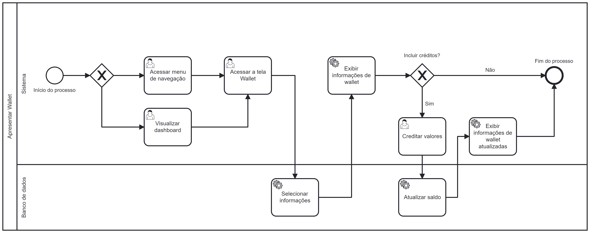

# Especificações do Projeto

Pré-requisitos: <a href="1-Documentação de Contexto.md"> Documentação de Contexto</a>

Definição do problema e ideia de solução a partir da perspectiva do usuário. É composta pela definição do diagrama de personas, histórias de usuários, requisitos funcionais e não funcionais além das restrições do projeto.

Apresente uma visão geral do que será abordado nesta parte do documento, enumerando as técnicas e/ou ferramentas utilizadas para realizar a especificações do projeto

## Personas

Pedro Paulo tem 26 anos, é arquiteto recém-formado e autônomo. Pensa em se desenvolver profissionalmente através de um mestrado fora do país, pois adora viajar, é solteiro e sempre quis fazer um intercâmbio. Está buscando uma agência que o ajude a encontrar universidades na Europa que aceitem alunos estrangeiros.

Enumere e detalhe as personas da sua solução. Para tanto, baseie-se tanto nos documentos disponibilizados na disciplina e/ou nos seguintes links:

> **Links Úteis**:
>
> - [Rock Content](https://rockcontent.com/blog/personas/)
> - [Hotmart](https://blog.hotmart.com/pt-br/como-criar-persona-negocio/)
> - [O que é persona?](https://resultadosdigitais.com.br/blog/persona-o-que-e/)
> - [Persona x Público-alvo](https://flammo.com.br/blog/persona-e-publico-alvo-qual-a-diferenca/)
> - [Mapa de Empatia](https://resultadosdigitais.com.br/blog/mapa-da-empatia/)
> - [Mapa de Stalkeholders](https://www.racecomunicacao.com.br/blog/como-fazer-o-mapeamento-de-stakeholders/)
>
> Lembre-se que você deve ser enumerar e descrever precisamente e personalizada todos os clientes ideais que sua solução almeja.

## Histórias de Usuários

Com base na análise das personas forma identificadas as seguintes histórias de usuários:

| EU COMO... `PERSONA` | QUERO/PRECISO ... `FUNCIONALIDADE` | PARA ... `MOTIVO/VALOR`                |
| -------------------- | ---------------------------------- | -------------------------------------- |
| Usuário do sistema   | Registrar minhas tarefas           | Não esquecer de fazê-las               |
| Administrador        | Alterar permissões                 | Permitir que possam administrar contas |

Apresente aqui as histórias de usuário que são relevantes para o projeto de sua solução. As Histórias de Usuário consistem em uma ferramenta poderosa para a compreensão e elicitação dos requisitos funcionais e não funcionais da sua aplicação. Se possível, agrupe as histórias de usuário por contexto, para facilitar consultas recorrentes à essa parte do documento.

> **Links Úteis**:
>
> - [Histórias de usuários com exemplos e template](https://www.atlassian.com/br/agile/project-management/user-stories)
> - [Como escrever boas histórias de usuário (User Stories)](https://medium.com/vertice/como-escrever-boas-users-stories-hist%C3%B3rias-de-usu%C3%A1rios-b29c75043fac)
> - [User Stories: requisitos que humanos entendem](https://www.luiztools.com.br/post/user-stories-descricao-de-requisitos-que-humanos-entendem/)
> - [Histórias de Usuários: mais exemplos](https://www.reqview.com/doc/user-stories-example.html)
> - [9 Common User Story Mistakes](https://airfocus.com/blog/user-story-mistakes/)

## Modelagem do Processo de Negócio

### Análise da Situação Atual

Apresente aqui os problemas existentes que viabilizam sua proposta. Apresente o modelo do sistema como ele funciona hoje. Caso sua proposta seja inovadora e não existam processos claramente definidos, apresente como as tarefas que o seu sistema pretende implementar são executadas atualmente, mesmo que não se utilize tecnologia computacional.

### Descrição Geral da Proposta

O principal objetivo da proposta é a modelagem dos processos de negócio para que estes estejam alinhados com as estratégias pretendidas.

Propõe-se também demonstrar o valor de cada processo para que todos os envolvidos no negócio tenham o mesmo entendimento acerca do funcionamento de uma atividade tendo-a como apoio o para o desenvolvimento da aplicação.

A modelagem propõe uma rotina de melhoria contínua do processo no contexto de toda a organização.

### Processo 1 – Efetuar login

O processo denominado “Efetuar Login” começa com o acesso ao aplicativo visualizando a tela de inicialização. Em seguida é apresentada a tela para inserção dos dados de acesso. Caso o usuário já seja cadastrado, ao inserir o e-mail e senha, sendo identificados pelo banco de dados, a sessão é iniciada com a visualização do dashboard.

Todavia, caso o usuário já cadastrado insira suas informações com e-mail correto, mas com senha inválida, o banco de dados não valida as inserções e o usuário permanece na tela para digitar dos dados corretos. Após isso, banco de dados reconhece a autenticação, a sessão inicia e apresenta a tela com o dashboard.

Em um terceiro cenário, em que o banco de dados não reconhece o e-mail, o usuário deverá realizar seu cadastro, selecionando seu perfil, sendo ele o de cliente ou de especialista, preenche os dados solicitados em tela. As informações são incluídas no banco de dados, o sistema confirma a realização do cadastro e direciona para a tela de login, as informações de acesso são incluídas, a sessão é iniciada e visualiza-se a tela de dashboard.

Por ser um processo que identifica o usuário na aplicação, sua importância é percebida na segurança dos dados ao se conectar na plataforma.

### Processo 2 – Ajustar dados cadastrais

O segundo processo, intitulado “Ajustar dados cadastrais” se inicia com a realização do login na aplicação. O processo segue com o acesso ao perfil onde é possível editar dados cadastrais, exceto CPF, CNPJ e em caso de especialista, sua categoria. Se os dados não estiverem preenchidos corretamente, a aplicação continua na tela de edição, caso contrário, o banco de dados salva as informações e o sistema exibe o perfil alterado.

O ajuste desses dados mantém o banco de dados atualizado e permite a integridade dos perfis que utilizam a aplicação.

### Processo 3 – Redefinir senha

Denominado “Redefinir senha” o processo 3 se inicia na tela de login. Nela, o usuário clica em “Esqueci minha senha” e assim ocorre o direcionamento para a tela “Esqueci minha senha”. Nessa etapa, é solicitado pelo sistema o preenchimento do e-mail. O aplicativo envia para o e-mail um PIN ao mesmo tempo que exibe na tela do usuário o campo para inserção deste. Ao constatar a compatibilidade do PIN digitado, o sistema direciona para a tela de redefinição de senha. Aqui, o usuário digita sua nova senha e a digita novamente no campo de confirmação. Assim o banco de dados se atualiza com o novo dado e é exibida para o usuário a confirmação da redefinição de senha.

A redefinição de senha também é necessária quando o usuário perceber que sua senha foi descoberta e para manter a confidencialidade dos dados.

### Processo 4 – Personalizar perfil do especialista

Este processo tem o nome “Personalizar perfil do especialista”. O especialista inicia o processo navegando pelo menu e nele selecionando a opção de “Editar perfil”. Aqui inclui-se informações personalizadas sobre sua atuação. O banco de dados salva essas inclusões e o processo termina quando é exibido na tela a informação de que o perfil foi atualizado.

Esse processo é importante pois ter esse tipo de informação é fundamental para que o cliente escolha um profissional com confiança.

### Processo 5 – Buscar especialista

“Buscar especialista” é o nome do processo 5. Para iniciar, o cliente acessa a tela com a listagem das categorias. Nela, busca a categoria que deseja sendo filtrado pelo banco de dados que exibe na tela o resultado da busca. Dentro da categoria escolhida, busca-se a especialidade e a sua exibição acontece após busca no banco de dados. Em seguida o cliente busca por especialistas, também apresentada a partir das informações obtidas no banco de dados. O cliente seleciona um especialista e por meio do banco de dados, suas informações são exibidas em tela. Em seguida, ao acessar a tela de checkout, o banco de dados busca a agenda do especialista e a exibe no aplicativo onde o cliente escolhe data e horário da consulta, o que resulta na reserva junto ao banco de dados. Em tela, é exibida a confirmação do agendamento.

Esse processo elenca muitas oportunidades de escolha ao cliente que pode seguimentar sua busca e encontrar profissionais adequados à sua necessidade.

### Processo 6 – Realizar consulta

O processo "Realizar consulta" tem seu início quando o cliente, logado na plataforma, acessa a sala virtual. O sistema exibe os termos de aceite. Se o cliente recusar os termos, o sistema o direciona para a tela inicial e finaliza o processo.

Na situação em que os termos são aceitos, o cliente visualiza uma tela de espera. Quando o especialista entrar na sala, dá-se início à consulta. Sendo esta realizada, o sistema direciona para a tela de avaliação. O cliente avalia o especialista e faz logout concluindo o processo.

### Processo 7 – Fazer contato com a plataforma

No processo 7 – Fazer contato com a plataforma, logado na aplicação, o usuário acessa o menu de navegação e seleciona a opção "Contato". É apresentada a tela de envio de mensagem. O usuário digita o texto desejado e envia a envia. O processo é concluído.

### Processo 8 – Gerenciar horários

O processo 8 é denominado “Gerenciar horários”. Com o login realizado, o especialista visualiza em seu dashboard as próximas consultas e agenda. Pode-se acessar os detalhes das consultas ou pode-se acessar os detalhes da agenda. É possível inserir alterações, como disponibilizar ou retirar horários da agenda. Caso isso seja feito, as alterações são salvas no banco de dados e encerra-se esse processo.

### Processo 9 – Apresentar wallet

No processo 9 – Apresentar wallet, o cliente pode acessar as informações por meio do menu ou no próprio dashboard. Ao acessar, a tela é carregada com informações vindas do banco de dados. Pode-se incluir ou não créditos. Finaliza-se o processo.

## Indicadores de Desempenho

Para análise e monitoramento do desempenho do negócio, com o intuito de auxiliar na tomada de decisões e planejamentos estratégicos, os seguintes indicadores foram definidos:

| Indicador                          | Objetivos                                                                                                | Descrição                                                                                                      | Cálculo                                                                               | Fonte dos Dados                                   | Perspectiva                                                   |
| ---------------------------------- | -------------------------------------------------------------------------------------------------------- | -------------------------------------------------------------------------------------------------------------- | ------------------------------------------------------------------------------------- | ------------------------------------------------- | ------------------------------------------------------------- |
| Atendimentos por categoria (share) | Identificar as categorias que possuem maior concentração de atendimentos                                 | Porcentagem de atendimentos por categoria em relação a quantidade de atendimentos totais                       | Atendimentos da categoria X / Total de atendimentos                                   | Tabela Schedule, Appointment Specialty e Category | Identificar potenciais especialistas                          |
| Novos clientes                     | Monitorar a quantidade de clientes novos no mês para desenvolver estratégias de captação                 | Número absoluto de clientes novos                                                                              | -                                                                                     | Tabela Client                                     | Aumentar a captação de clientes                               |
| Percentual de clientes ativos      | Traçar estratégias de retenção a partir da quantidade de usuários que efetivamente utilizam a plataforma | Porcentagem de clientes que realizaram atendimento em relação a clientes cadastrados na plataforma             | Clientes que efeturam atendimento no mês / Clientes cadastrados no app                | Tabela Client e Schedule                          | Melhorar a conversão de clientes ativos e aumentar a retenção |
| Percentual de especialistas ativos | Aumentar a conversão de especialistas que realizam atendimentos                                          | Identificar o percentual de especialistas cadastrados                                                          | Especialistas que realizaram atendimento no mês / especialistas cadastrados           | Tabela Specialist e Schedule                      | Melhorar a conversão de especialistas ativos                  |
| _Churn_ de especialistas           | Analisar especialistas que optaram por deixar de utilizar a plataforma, a fim de reduzir este número     | Especialistas que não realizam atendimentos há mais de 45 dias e especialistas que optaram por excluir a conta | Especialistas que não realizam atendimentos há mais de 45 dias / especialistas ativos | Tabela Specialist e Schedule                      | Diminuir o _churn_ dos especialistas                          |
| Receita mensal                     | Monitorar a receita mensal para criar estratégias de rentabilidade                                       | Receita gerada pelos espeacialistas através do aluguel das salas virtuais                                      | Soma dos pagamentos realizados no mês                                                 | Tabela Payments                                   | Aumentar a receita mensal                                     |

## Requisitos

O desenvolvimento do aplicativo se baseia na implementação e no alcance dos critérios de aceite (DoDs) dos seguintes requisitos funcionais e não funcionais:

### Requisitos Funcionais

| ID     | Descrição do Requisito                                                                                         | Prioridade |
| ------ | -------------------------------------------------------------------------------------------------------------- | ---------- |
| RF-001 | O aplicativo deve oferecer um login aos usuários.                                                              | ALTA       |
| RF-002 | O aplicativo deve fornecer um formulário de cadastro para clientes.                                            | ALTA       |
| RF-003 | O aplicativo deve fornecer um formulário de cadastro para especialistas.                                       | ALTA       |
| RF-004 | O aplicativo deve fornecer uma opção de redefinição de senha.                                                  | MÉDIA      |
| RF-005 | O aplicativo deve fornecer opções de ajustes de dados cadastrais.                                              | MÉDIA      |
| RF-006 | O aplicativo deve oferecer uma barra de navegação entre as telas internas.                                     | ALTA       |
| RF-007 | O aplicativo deve permitir fazer logout.                                                                       | ALTA       |
| RF-008 | O aplicativo deve fornecer uma tela inicial para clientes, contendo suas próximas consultas.                   | ALTA       |
| RF-009 | O aplicativo deve fornecer uma tela de listagem de categorias para filtrar especialidades.                     | ALTA       |
| RF-010 | O aplicativo deve fornecer uma tela de listagem de especialidades para filtrar especialistas.                  | ALTA       |
| RF-011 | O aplicativo deve permitir que o cliente veja o perfil profissional do especialista e sua agenda.              | ALTA       |
| RF-012 | O aplicativo deve permitir que o cliente agende uma consulta por meio de uma tela de checkout.                 | ALTA       |
| RF-013 | O aplicativo deve permitir que o cliente gerencie seus créditos por meio de uma tela de wallet.                | ALTA       |
| RF-014 | O aplicativo deve fornecer uma tela inicial para especialistas, contendo suas próximas consultas e sua agenda. | ALTA       |
| RF-015 | O aplicativo deve fornecer uma tela de acompanhamento de ganhos do especialista.                               | ALTA       |
| RF-016 | O aplicativo deve fornecer uma tela de gestão de horários do especialista.                                     | ALTA       |
| RF-017 | O aplicativo deve fornecer uma tela de personalização do seu perfil profissional.                              | ALTA       |
| RF-018 | O aplicativo deve fornecer uma tela de gestão de contas de repasse para coletar os ganhos de um especialista.  | MÉDIA      |
| RF-019 | O aplicativo deve fornecer uma tela de videochamada para realização das consultas no horário agendado.         | ALTA       |
| RF-020 | O aplicativo deve fornecer uma tela de avaliação de especialistas e clientes após o fim da consulta.           | ALTA       |
| RF-021 | O aplicativo deve fornecer uma tela de espera enquanto a consulta programada não é iniciada.                   | ALTA       |
| RF-022 | O aplicativo deve fornecer uma tela de aceite para ingressar na consulta.                                      | MÉDIA      |
| RF-023 | O aplicativo deve possibilitar a reconexão à consulta em caso de quedas de rede ou falhas técnicas.            | MÉDIA      |
| RF-024 | O aplicativo deve fornecer um canal de ajuda a clientes e especialistas.                                       | BAIXA      |
| RF-025 | O aplicativo deve fornecer uma tela de carregamento (spinner) ao realizar consultas assíncronas (back-end).    | ALTA       |
| RF-026 | O aplicativo deve fornecer uma tela de inicialização (splash screen).                                          | ALTA       |

### Requisitos não Funcionais

| ID      | Descrição do Requisito                                                                                                                                        | Prioridade |
| ------- | ------------------------------------------------------------------------------------------------------------------------------------------------------------- | ---------- |
| RNF-001 | Deverá ser disponibilizado em um ambiente acessível publicamente na Internet.                                                                                 | ALTA       |
| RNF-002 | Deverá se adaptar ao formato de tela do dispositivo móvel utilizado, sem que ocorram distorções.                                                              | ALTA       |
| RNF-003 | A aplicação utilizará o protocolo WebRTC para viabilizar as chamadas de vídeos.                                                                               | ALTA       |
| RNF-005 | O aplicativo deve ser compatível com as versões mais recentes do sistema Android.                                                                             | ALTA       |
| RNF-006 | O aplicativo deve estar disponível 99,9% do tempo.                                                                                                            | MÉDIA      |
| RNF-007 | O sistema disponibilizará às funcionalidades ao usuário de maneira simples e intuitiva, com foco na UX.                                                       | ALTA       |
| RNF-008 | A aplicação deverá informar ao usuário sobre erros que impeçam o funcionamento correto do aplicativo, como falta de conexão, erros do servidor, entre outros. | ALTA       |
| RNF-009 | Deve-se ter um sistema de segurança para proteger as informações dos usuários.                                                                                | MÉDIA      |
| RNF-010 | O aplicativo deve oferecer algum suporte multiplataforma (iOS).                                                                                               | BAIXA      |
| RNF-011 | O aplicativo deve se adaptar ao esquema de cores do sistema (dark mode).                                                                                      | BAIXA      |

## Restrições

O projeto está restrito pelos itens apresentados na tabela a seguir:

| ID     | Restrição                                                                    |
| ------ | ---------------------------------------------------------------------------- |
| RE-001 | O aplicativo será suportado apenas para smartphones no formato **PORTRAIT**. |
| RE-002 | O aplicativo funcionará apenas com conexão à internet.                       |
| RE-003 | O aplicativo contará com serviços de back-end hospedados na suite Azure.     |

## Diagrama de Casos de Uso

> **Links Úteis**:
>
> - [Criando Casos de Uso](https://www.ibm.com/docs/pt-br/elm/6.0?topic=requirements-creating-use-cases)
> - [Como Criar Diagrama de Caso de Uso: Tutorial Passo a Passo](https://gitmind.com/pt/fazer-diagrama-de-caso-uso.html/)
> - [Lucidchart](https://www.lucidchart.com/)
> - [Astah](https://astah.net/)
> - [Diagrams](https://app.diagrams.net/)

# Matriz de Rastreabilidade

A matriz de rastreabilidade é uma ferramenta usada para facilitar a visualização dos relacionamento entre requisitos e outros artefatos ou objetos, permitindo a rastreabilidade entre os requisitos e os objetivos de negócio.

A matriz deve contemplar todos os elementos relevantes que fazem parte do sistema, conforme a figura meramente ilustrativa apresentada a seguir.

- A repetição do RF-001 se dá pelo fato de para acessar o aplicativo é necessário possuir login.
- A tela referente no RF-008 está localizado na barra de navegação citado no RF-006.
- Para possuir a opção de filtragem de especilidades (RF-010) é necessario anteriormente possuir a filtragem de categorias (RF-009).
- A tela referente no RF-016 terá um atalho da mesma na tela do RF-014.
- O RF-015 seria uma pré visulaização da tela RF-18.
- Ao aceitar entrar na consulta (RF-022) e não estiver ambos presentes haverá uma tela espera (RF-021).
- A repetição do RNF-008 se dá pelo fato de a aplicação informar ao usuário sobre erros que impeçam o funcionamento correto do aplicativo.
- o protocolo citado no RNF-003 será utilizado no RF-019.

> **Links Úteis**:
>
> - [Artigo Engenharia de Software 13 - Rastreabilidade](https://www.devmedia.com.br/artigo-engenharia-de-software-13-rastreabilidade/12822/)
> - [Verificação da rastreabilidade de requisitos usando a integração do IBM Rational RequisitePro e do IBM ClearQuest Test Manager](https://developer.ibm.com/br/tutorials/requirementstraceabilityverificationusingrrpandcctm/)
> - [IBM Engineering Lifecycle Optimization – Publishing](https://www.ibm.com/br-pt/products/engineering-lifecycle-optimization/publishing/)

# Gerenciamento de Projeto

Observando o cronograma geral dos entregavéis do projeto, figura abaixo, junto aos requisitos, foi possível a criação de um plano de gestão que contempla a gestão de tempo e recursos que serão utilizados durante o projeto.

## Gerenciamento de Tempo

O prazo total para a entrega do projeto é de 128 dias a partir do dia 01/08/2022, sem descontar os finais de semana e feriados, assim seguindo o cronograma geral, foi possível elaborar uma tabela com os marcos de início e fim das tarefas planejadas, conforme abaixo:

| Projeto                                      | Inicio     | Fim        |
| -------------------------------------------- | ---------- | ---------- |
| Documentação do Projeto                      | 01/08/2022 | 07/12/2022 |
| Design de Telas                              | 12/09/2022 | 27/09/2022 |
| Desenvolvimento do Banco de Dados            | 08/08/2022 | 31/08/2022 |
| Programação de Funiconalidades: Cliente      | 27/09/2022 | 20/11/2022 |
| Programação de Funiconalidades: Especialista | 27/09/2022 | 20/11/2022 |
| Conexão da API ao Frontend                   | 17/10/2022 | 20/11/2022 |
| Elaboração do plano de testes                | 27/09/2022 | 09/10/2022 |
| Testes de usabilidade                        | 10/10/2022 | 27/11/2022 |
| Testes de funcionalidades                    | 10/10/2022 | 27/11/2022 |
| Elaboração da apresentação do projeto        | 30/11/2022 | 07/12/2022 |

Para facilitar a visualização das atividades foi elaborado um gráfico de Gantt para mostrar o fluxo das atividades:

## Gerenciamento de Equipe

A equipe será separada em três frentes: Eq. Backend, Eq. Frontend-Client, Eq. Frontend-Specialist, essas três equipes são responsáveis pela programação de backend em ambiente C#.net, Programação das funcionalidades em ambiente React Native e design das telas com foco na jornada do cliente no aplicativo e Programação das funcionalidades em ambiente React Native e design das telas com foco na jornada do especialista no aplicativo. Sendo essas equipes gerenciadas pelo Scrum Master e pelo Product Owner.

Com base nas equipes e cronograma de gestão de tempo, as responsabilidades de cada equipe foram atribuidas de acordo com a imagem abaixo:

## Gestão de Orçamento

Observando os custos médios no site Glassdoor, foi encontrado os salários médios para os cargos atribuidos ao projeto, sabendo que a demanda total em horas do projeto é de 540 horas descontando os finais de semana e com uma jornada de 6 horas/ dia, foi possível elaborar uma tabela contendo o h-h, homem-hora dos recursos humanos necessários para a elaboração do projeto.

| Função                   | H-h (R$/hora) |
| ------------------------ | ------------- |
| Scrum Master             | 60,61         |
| Product Owner            | 60,61         |
| Programador .net         | 35,71         |
| Programador React Native | 22,73         |

Com equipamentos, foram atribuidos os custos de notebooks entre outros para o auxílio do trabalho. Os custos de software foi computado os custos de software para o auxílio a programação dos membros e desenvolvimento de software, como licenças de IDE's, utilização de API's entre outros, já os custos de operação são ligados aos custos com servidor web que comporte a aplicação, nesse caso foi escolhido a utilização do Microsoft Azure. Ao final foi acresentado um adicional de 20% aos custos para comportar possíveis oscilações de custos durante a elaboração do projeto.

| Recursos               | Custos (R$)   |
| ---------------------- | ------------- |
| R. Humanos             | 97.011,82     |
| R. de Equipamentos     | 19.109,93     |
| R. de Softwares        | 3.815,80      |
| R. de Operação         | 16.778,85     |
| Custo Total            | R$ 136.716,40 |
| Custo Final de Projeto | R$ 164.059,67 |
