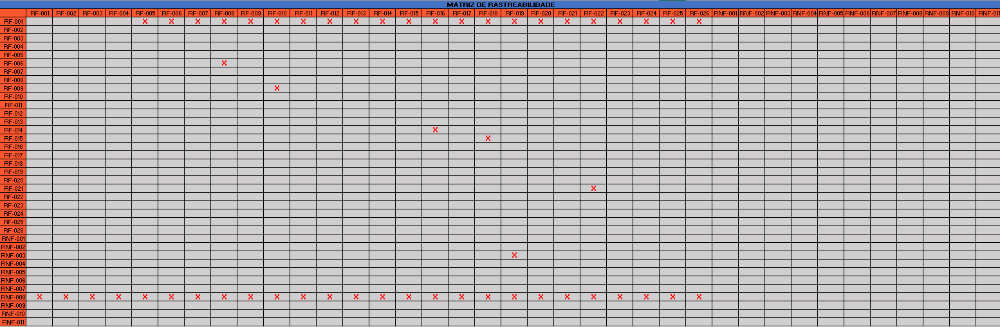
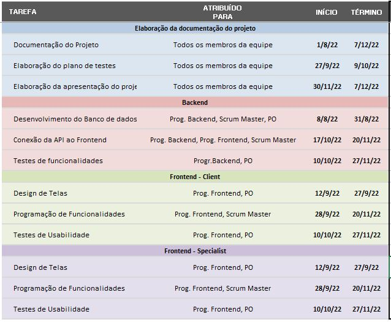

# Especificações do Projeto

Pré-requisitos: <a href="1-Documentação de Contexto.md"> Documentação de Contexto</a>

Definição do problema e ideia de solução a partir da perspectiva do usuário. É composta pela definição do  diagrama de personas, histórias de usuários, requisitos funcionais e não funcionais além das restrições do projeto.

Apresente uma visão geral do que será abordado nesta parte do documento, enumerando as técnicas e/ou ferramentas utilizadas para realizar a especificações do projeto

## Personas

Pedro Paulo tem 26 anos, é arquiteto recém-formado e autônomo. Pensa em se desenvolver profissionalmente através de um mestrado fora do país, pois adora viajar, é solteiro e sempre quis fazer um intercâmbio. Está buscando uma agência que o ajude a encontrar universidades na Europa que aceitem alunos estrangeiros.

Enumere e detalhe as personas da sua solução. Para tanto, baseie-se tanto nos documentos disponibilizados na disciplina e/ou nos seguintes links:

> **Links Úteis**:
> - [Rock Content](https://rockcontent.com/blog/personas/)
> - [Hotmart](https://blog.hotmart.com/pt-br/como-criar-persona-negocio/)
> - [O que é persona?](https://resultadosdigitais.com.br/blog/persona-o-que-e/)
> - [Persona x Público-alvo](https://flammo.com.br/blog/persona-e-publico-alvo-qual-a-diferenca/)
> - [Mapa de Empatia](https://resultadosdigitais.com.br/blog/mapa-da-empatia/)
> - [Mapa de Stalkeholders](https://www.racecomunicacao.com.br/blog/como-fazer-o-mapeamento-de-stakeholders/)
>
Lembre-se que você deve ser enumerar e descrever precisamente e personalizada todos os clientes ideais que sua solução almeja.

## Histórias de Usuários

Com base na análise das personas forma identificadas as seguintes histórias de usuários:

|EU COMO... `PERSONA`| QUERO/PRECISO ... `FUNCIONALIDADE` |PARA ... `MOTIVO/VALOR`                 |
|--------------------|------------------------------------|----------------------------------------|
|Usuário do sistema  | Registrar minhas tarefas           | Não esquecer de fazê-las               |
|Administrador       | Alterar permissões                 | Permitir que possam administrar contas |

Apresente aqui as histórias de usuário que são relevantes para o projeto de sua solução. As Histórias de Usuário consistem em uma ferramenta poderosa para a compreensão e elicitação dos requisitos funcionais e não funcionais da sua aplicação. Se possível, agrupe as histórias de usuário por contexto, para facilitar consultas recorrentes à essa parte do documento.

> **Links Úteis**:
> - [Histórias de usuários com exemplos e template](https://www.atlassian.com/br/agile/project-management/user-stories)
> - [Como escrever boas histórias de usuário (User Stories)](https://medium.com/vertice/como-escrever-boas-users-stories-hist%C3%B3rias-de-usu%C3%A1rios-b29c75043fac)
> - [User Stories: requisitos que humanos entendem](https://www.luiztools.com.br/post/user-stories-descricao-de-requisitos-que-humanos-entendem/)
> - [Histórias de Usuários: mais exemplos](https://www.reqview.com/doc/user-stories-example.html)
> - [9 Common User Story Mistakes](https://airfocus.com/blog/user-story-mistakes/)

## Modelagem do Processo de Negócio 

### Análise da Situação Atual

Apresente aqui os problemas existentes que viabilizam sua proposta. Apresente o modelo do sistema como ele funciona hoje. Caso sua proposta seja inovadora e não existam processos claramente definidos, apresente como as tarefas que o seu sistema pretende implementar são executadas atualmente, mesmo que não se utilize tecnologia computacional. 

### Descrição Geral da Proposta

Apresente aqui uma descrição da sua proposta abordando seus limites e suas ligações com as estratégias e objetivos do negócio. Apresente aqui as oportunidades de melhorias.

### Processo 1 – NOME DO PROCESSO

Apresente aqui o nome e as oportunidades de melhorias para o processo 1. Em seguida, apresente o modelo do processo 1, descrito no padrão BPMN. 

### Processo 2 – NOME DO PROCESSO

Apresente aqui o nome e as oportunidades de melhorias para o processo 2. Em seguida, apresente o modelo do processo 2, descrito no padrão BPMN.

## Indicadores de Desempenho

Apresente aqui os principais indicadores de desempenho e algumas metas para o processo. Atenção: as informações necessárias para gerar os indicadores devem estar contempladas no diagrama de classe. Colocar no mínimo 5 indicadores. 

Usar o seguinte modelo: 

Obs.: todas as informações para gerar os indicadores devem estar no diagrama de classe a ser apresentado a posteriori. 

## Requisitos

O desenvolvimento do aplicativo se baseia na implementação e no alcance dos critérios de aceite (DoDs) dos seguintes requisitos funcionais e não funcionais:

### Requisitos Funcionais

| ID     | Descrição do Requisito                                                                                         | Prioridade |
|--------|----------------------------------------------------------------------------------------------------------------|------------|
| RF-001 | O aplicativo deve oferecer um login aos usuários.                                                              | ALTA       | 
| RF-002 | O aplicativo deve fornecer um formulário de cadastro para clientes.                                            | ALTA       |
| RF-003 | O aplicativo deve fornecer um formulário de cadastro para especialistas.                                       | ALTA       |
| RF-004 | O aplicativo deve fornecer uma opção de redefinição de senha.                                                  | MÉDIA      |
| RF-005 | O aplicativo deve fornecer opções de ajustes de dados cadastrais.                                              | MÉDIA      |
| RF-006 | O aplicativo deve oferecer uma barra de navegação entre as telas internas.                                     | ALTA       |
| RF-007 | O aplicativo deve permitir fazer logout.                                                                       | ALTA       |
| RF-008 | O aplicativo deve fornecer uma tela inicial para clientes, contendo suas próximas consultas.                   | ALTA       |
| RF-009 | O aplicativo deve fornecer uma tela de listagem de categorias para filtrar especialidades.                     | ALTA       |
| RF-010 | O aplicativo deve fornecer uma tela de listagem de especialidades para filtrar especialistas.                  | ALTA       |
| RF-011 | O aplicativo deve permitir que o cliente veja o perfil profissional do especialista e sua agenda.              | ALTA       |
| RF-012 | O aplicativo deve permitir que o cliente agende uma consulta por meio de uma tela de checkout.                 | ALTA       |
| RF-013 | O aplicativo deve permitir que o cliente gerencie seus créditos por meio de uma tela de wallet.                | ALTA       |
| RF-014 | O aplicativo deve fornecer uma tela inicial para especialistas, contendo suas próximas consultas e sua agenda. | ALTA       |
| RF-015 | O aplicativo deve fornecer uma tela de acompanhamento de ganhos do especialista.                               | ALTA       |
| RF-016 | O aplicativo deve fornecer uma tela de gestão de horários do especialista.                                     | ALTA       |
| RF-017 | O aplicativo deve fornecer uma tela de personalização do seu perfil profissional.                              | ALTA       |
| RF-018 | O aplicativo deve fornecer uma tela de gestão de contas de repasse para coletar os ganhos de um especialista.  | MÉDIA      |
| RF-019 | O aplicativo deve fornecer uma tela de videochamada para realização das consultas no horário agendado.         | ALTA       |
| RF-020 | O aplicativo deve fornecer uma tela de avaliação de especialistas e clientes após o fim da consulta.           | ALTA       |
| RF-021 | O aplicativo deve fornecer uma tela de espera enquanto a consulta programada não é iniciada.                   | ALTA       |
| RF-022 | O aplicativo deve fornecer uma tela de aceite para ingressar na consulta.                                      | MÉDIA      |
| RF-023 | O aplicativo deve possibilitar a reconexão à consulta em caso de quedas de rede ou falhas técnicas.            | MÉDIA      |
| RF-024 | O aplicativo deve fornecer um canal de ajuda a clientes e especialistas.                                       | BAIXA      |
| RF-025 | O aplicativo deve fornecer uma tela de carregamento (spinner) ao realizar consultas assíncronas (back-end).    | ALTA       |
| RF-026 | O aplicativo deve fornecer uma tela de inicialização (splash screen).                                          | ALTA       |

### Requisitos não Funcionais

| ID      | Descrição do Requisito                                                                                                                                        | Prioridade |
|---------|---------------------------------------------------------------------------------------------------------------------------------------------------------------|------------|
| RNF-001 | Deverá ser disponibilizado em um ambiente acessível publicamente na Internet.                                                                                 | ALTA       | 
| RNF-002 | Deverá se adaptar ao formato de tela do dispositivo móvel utilizado, sem que ocorram distorções.                                                              | ALTA       |
| RNF-003 | A aplicação utilizará o protocolo WebRTC para viabilizar as chamadas de vídeos.                                                                               | ALTA       |
| RNF-005 | O aplicativo deve ser compatível com as versões mais recentes do sistema Android.                                                                             | ALTA       |
| RNF-006 | O aplicativo deve estar disponível 99,9% do tempo.                                                                                                            | MÉDIA      |
| RNF-007 | O sistema disponibilizará às funcionalidades ao usuário de maneira simples e intuitiva, com foco na UX.                                                       | ALTA       |
| RNF-008 | A aplicação deverá informar ao usuário sobre erros que impeçam o funcionamento correto do aplicativo, como falta de conexão, erros do servidor, entre outros. | ALTA       |
| RNF-009 | Deve-se ter um sistema de segurança para proteger as informações dos usuários.                                                                                | MÉDIA      |
| RNF-010 | O aplicativo deve oferecer algum suporte multiplataforma (iOS).                                                                                               | BAIXA      |
| RNF-011 | O aplicativo deve se adaptar ao esquema de cores do sistema (dark mode).                                                                                      | BAIXA      |

## Restrições

O projeto está restrito pelos itens apresentados na tabela a seguir:

| ID     | Restrição                                                                    |
|--------|------------------------------------------------------------------------------|
| RE-001 | O aplicativo será suportado apenas para smartphones no formato **PORTRAIT**. |
| RE-002 | O aplicativo funcionará apenas com conexão à internet.                       |
| RE-003 | O aplicativo contará com serviços de back-end hospedados na suite Azure.     |

## Diagrama de Casos de Uso

O diagrama de casos de uso é o próximo passo após a elicitação de requisitos, que utiliza um modelo gráfico e uma tabela com as descrições sucintas dos casos de uso e dos atores. Ele contempla a fronteira do sistema e o detalhamento dos requisitos funcionais com a indicação dos atores, casos de uso e seus relacionamentos. 

As referências abaixo irão auxiliá-lo na geração do artefato “Diagrama de Casos de Uso”.

> **Links Úteis**:
> - [Criando Casos de Uso](https://www.ibm.com/docs/pt-br/elm/6.0?topic=requirements-creating-use-cases)
> - [Como Criar Diagrama de Caso de Uso: Tutorial Passo a Passo](https://gitmind.com/pt/fazer-diagrama-de-caso-uso.html/)
> - [Lucidchart](https://www.lucidchart.com/)
> - [Astah](https://astah.net/)
> - [Diagrams](https://app.diagrams.net/)

# Matriz de Rastreabilidade

A matriz de rastreabilidade é uma ferramenta usada para facilitar a visualização dos relacionamento entre requisitos e outros artefatos ou objetos, permitindo a rastreabilidade entre os requisitos e os objetivos de negócio. 

A matriz deve contemplar todos os elementos relevantes que fazem parte do sistema, conforme a figura meramente ilustrativa apresentada a seguir.

> **Links Úteis**:
> - [Artigo Engenharia de Software 13 - Rastreabilidade](https://www.devmedia.com.br/artigo-engenharia-de-software-13-rastreabilidade/12822/)
> - [Verificação da rastreabilidade de requisitos usando a integração do IBM Rational RequisitePro e do IBM ClearQuest Test Manager](https://developer.ibm.com/br/tutorials/requirementstraceabilityverificationusingrrpandcctm/)
> - [IBM Engineering Lifecycle Optimization – Publishing](https://www.ibm.com/br-pt/products/engineering-lifecycle-optimization/publishing/)

# Gerenciamento de Projeto

Observando o cronograma geral dos entregavéis do projeto, figura abaixo, junto aos requisitos, foi possível a criação de um plano de gestão que contempla a gestão de tempo e recursos que serão utilizados durante o projeto.

## Gerenciamento de Tempo

O prazo total para a entrega do projeto é de 128 dias a partir do dia 01/08/2022, sem descontar os finais de semana e feriados, assim seguindo o cronograma geral, foi possível elaborar uma tabela com os marcos de início e fim das tarefas planejadas, conforme abaixo:

| Projeto                                     | Inicio       | Fim         |
|---------------------------------------------|--------------|-------------|
|Documentação do Projeto                      | 01/08/2022   | 07/12/2022  |
|Design de Telas                              | 12/09/2022   | 27/09/2022  |
|Desenvolvimento do Banco de Dados            | 08/08/2022   | 31/08/2022  |
|Programação de Funiconalidades: Cliente      | 27/09/2022   | 20/11/2022  |
|Programação de Funiconalidades: Especialista | 27/09/2022   | 20/11/2022  |
|Conexão da API ao Frontend                   | 17/10/2022   | 20/11/2022  |
|Elaboração do plano de testes                | 27/09/2022   | 09/10/2022  |
|Testes de usabilidade                        | 10/10/2022   | 27/11/2022  |
|Testes de funcionalidades                    | 10/10/2022   | 27/11/2022  |
|Elaboração da apresentação do projeto        | 30/11/2022   | 07/12/2022  |

Para facilitar a visualização das atividades foi elaborado um gráfico de Gantt para mostrar o fluxo das atividades:

## Gerenciamento de Equipe

A equipe será separada em três frentes: Eq. Backend, Eq. Frontend-Client, Eq. Frontend-Specialist, essas três equipes são responsáveis pela programação de backend em ambiente C#.net, Programação das funcionalidades em ambiente React Native e design das telas com foco na jornada do cliente no aplicativo e Programação das funcionalidades em ambiente React Native e design das telas com foco na jornada do especialista no aplicativo. Sendo essas equipes gerenciadas pelo Scrum Master e pelo Product Owner.

Com base nas equipes e cronograma de gestão de tempo, as responsabilidades de cada equipe foram atribuidas de acordo com a imagem abaixo:

## Gestão de Orçamento

Observando os custos médios no site Glassdoor, foi encontrado os salários médios para os cargos atribuidos ao projeto, sabendo que a demanda total em horas do projeto é de 540 horas descontando os finais de semana e com uma jornada de 6 horas/ dia, foi possível elaborar uma tabela contendo o h-h, homem-hora dos recursos humanos necessários para a elaboração do projeto.

| Função                   | H-h   |
|--------------------------|-------|
| Scrum Master             | 60,61 |
| Product Owner            | 60,61 |
| Programador .net         | 35,71 |
| Programador React Native | 22,73 |

Com equipamentos, foram atribuidos os custos de notebooks entre outros para o auxílio do trabalho. Os custos de software foi computado os custos de software para o auxílio a programação dos membros e desenvolvimento de software, como licenças de IDE's, utilização de API's entre outros, já os custos de operação são ligados aos custos com servidor web que comporte a aplicação, nesse caso foi escolhido a utilização do Microsoft Azure. Ao final foi acresentado um adicional de 20% aos custos para comportar possíveis oscilações de custos durante a elaboração do projeto.

| Recursos                   | Custos (R$)    |
|----------------------------|----------------|
| R. Humanos                 |     97.011,82  |
| R. de Equipamentos         |     19.109,93  |
| R. de Softwares            |      3.815,80  |
| R. de Operação             |     16.778,85  |
| Custo Total                | R$ 136.716,40  |
| Custo Final de Projeto     | R$ 164.059,67  |
