# Projeto de Interface

Para o projeto de interface foram desenvolvidos um Diagrama de fluxo e wireframes que demonstram as interações possíveis de ser executadas pelo usuário através das telas do sistema.

## Diagrama de Fluxo

O diagrama apresenta o estudo do fluxo de interação do usuário com o sistema interativo e  muitas vezes sem a necessidade do desenho do design das telas da interface. Isso permite que o design das interações seja bem planejado e gere impacto na qualidade dos wireframes.

## Wireframes

Foram desenvolvidos wireframes de baixa fidelidade na ferramenta Figma, para auxiliar na definição da estrutura da solução e para facilitar a compreensão da equipe com relação as possíveis telas existentes no sistema. 

### RF-001 - Tela de Login
A Tela de Login é a primeira tela interativa do projeto. Ao abrir o aplicativo o usuário será direcionado para essa tela. Nela contém o logo do projeto seguido de um formulário para login e dois botões: um para recuperação da senha e outro de redirecionamento para tela de cadastro.

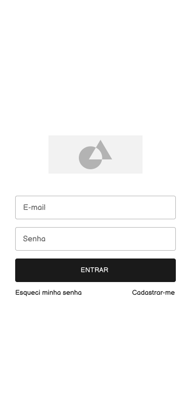

### RF-002 - Tela de cadastro de Clientes
A Tela de cadastro de Clientes contém o logo da aplicação e um formulário com as informações necessárias do usuário que utilizará a aplicação como um cliente da ferramenta.

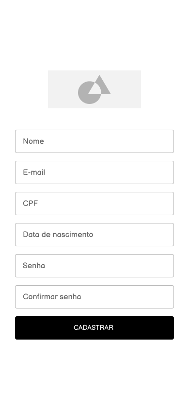

### RF-003 - Tela de cadastro de Especialistas
A Tela de cadastro de especialistas contém o logo da aplicação e um formulário com as informações necessárias do usuário que utilizará a aplicação como um especialista da plataforma.

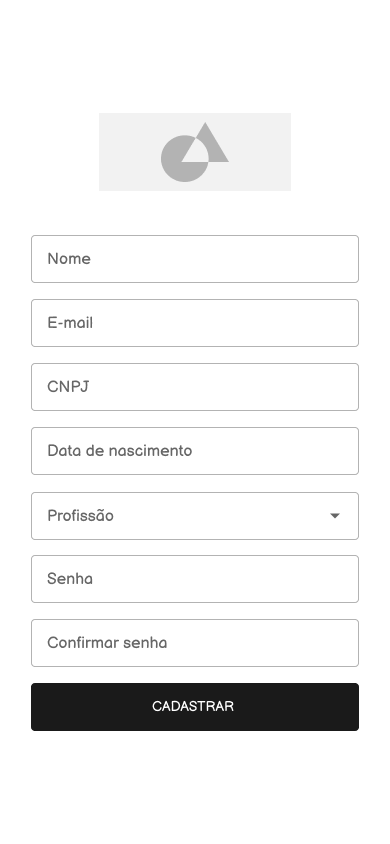

### RF-004 - Telas de Redefinição de Senha
Para redefinir a senha a proposta é que o usuário seja redirecionado para a tela de "esqueci minha senha" que apresenta o logo da aplicação, um texto explicativo sobre o processo de redefinição de senha e o formulário a ser preenchido. O usuário receberá um link por email que o redirecionará para a tela de redefinição de senha. Nessa, haverá o formulário para redefinição.

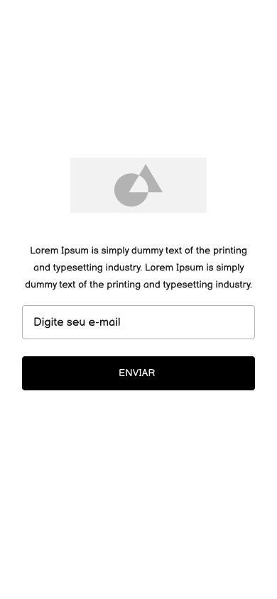
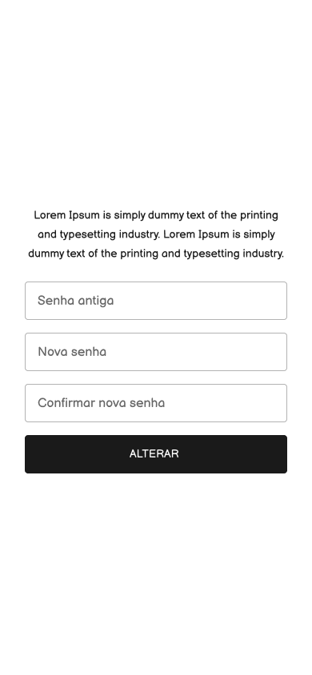

### RF-005 - Tela de ajustes de Dados Cadastrais
O usuário poderá redefinir os dados cadastrados por meio da tela de ajustes de dados cadastrais. Nessa tela o usuário poderá trocar a imagem de perfil e os dados informados no formulário da tela de cadastro.

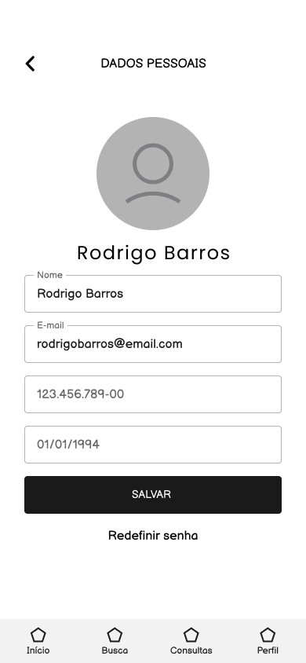

### RF-006 e RF-007 - Tela de Ajuste de Contas
Na tela de ajuste de contas o usuário terá acesso a um menu com opções de ajustes da conta, além de um botão de logout e a barra de navegação entre as telas do 
aplicativo. 

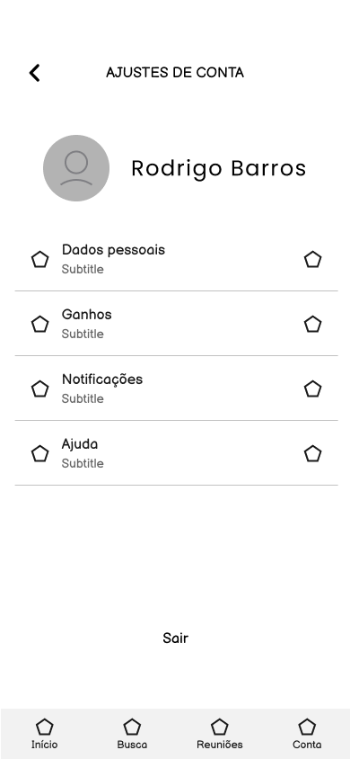

### RF-008 - Dashboard dos Clientes
Na tela de dashboard dos clientes haverá um card com as próximas consultas agendadas e em caso de não haver nenhuma marcação terá apenas um card de redirecionamento para a busca de especialistas. 

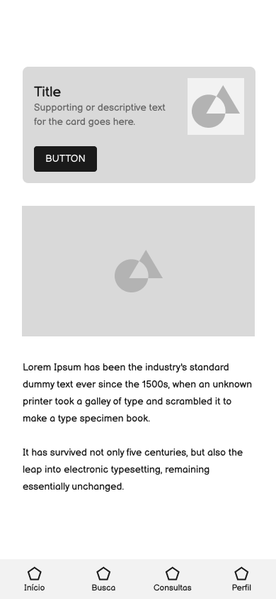

### RF-009 - Tela de Listagem de Categorias
Na tela de listagem de categorias haverá vários cards com as categorias de especialidades e um campo de busca para que o usuário realize a pesquisa. 

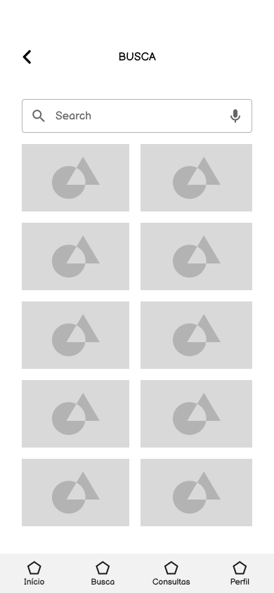

### RF-010 - Tela de Listagem de Especialidades
Na tela de listagem de especialidades haverá um menu com as especialidades da categoria determinada pelo usuário e ao acessar a especialidade escolhida o cliente
será redirecionado para uma lista de profissionais da mesma. Na tela também há um campo de busca, um botão de retorno e a barra de navegação. 

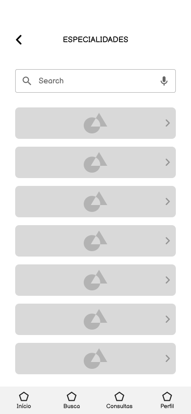

### RF-011 - Tela de Perfil do Especialista e Tela de Listagem de Especialistas
Ao selecionar a especialidade na tela de listagem de especialidades o usuário é redirecionado para a tela de listagem de especialistas. A tela contém um botão de retorno, um campo de busca, um campo de filtros, a barra de navegação e os cards dos especialistas. Ao selecionar um especialista o cliente é redirecionado para a a tela de perfil do especialista onde há informações sobre o mesmo e sua agenda. 

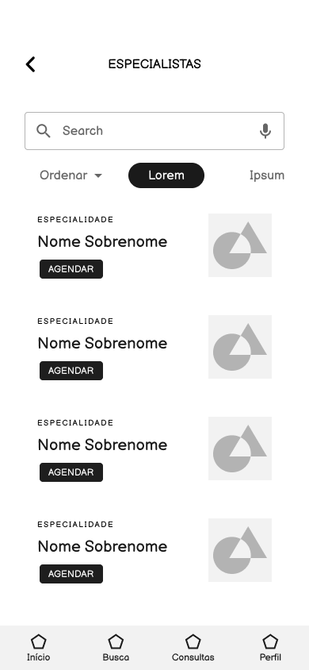

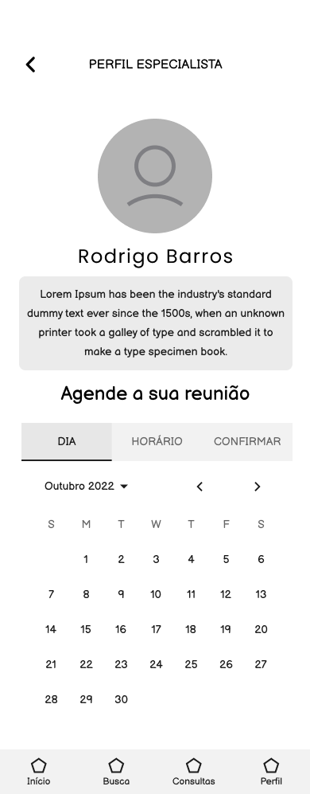

### RF-012 - Tela de Checkout
Ao escolher agendar uma reunião na tela do especialista o usuário é encaminhado para a tela de checkout. Nela haverá um card com as informações selecionadas e a o formulário de pagamento. Também há o botão de retorno e a barra de navegação.

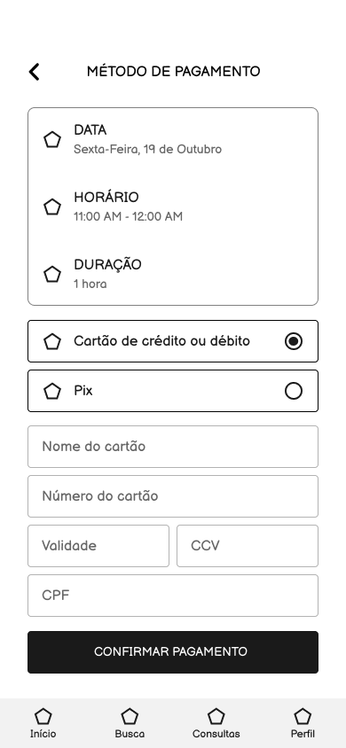

### RF-013 - Tela de Carteira
Na tela de carteira haverá a informação do saldo do usuário, além das formas de pagamentos cadastradas e o histórico de transações. Também haverá o botão de retorno e o menu de navegação. 

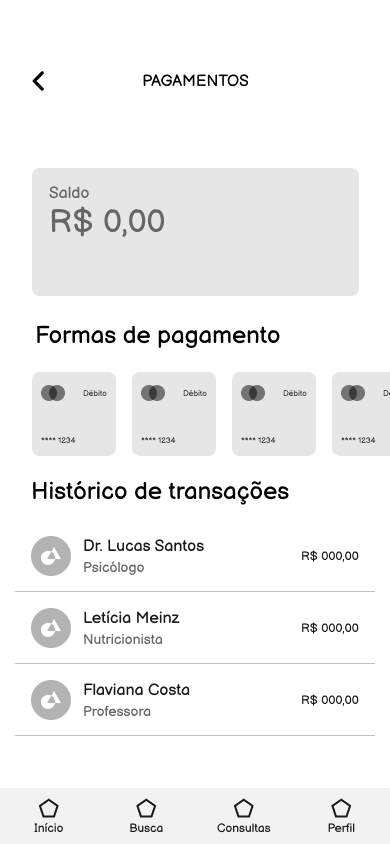

### RF-014 - Tela de Dashboard do Especialista
Na tela de dashboard dos especialistas haverá um card com as próximas consultas agendadas e a agenda do especialista, além do menu de navegação do aplicativo. 

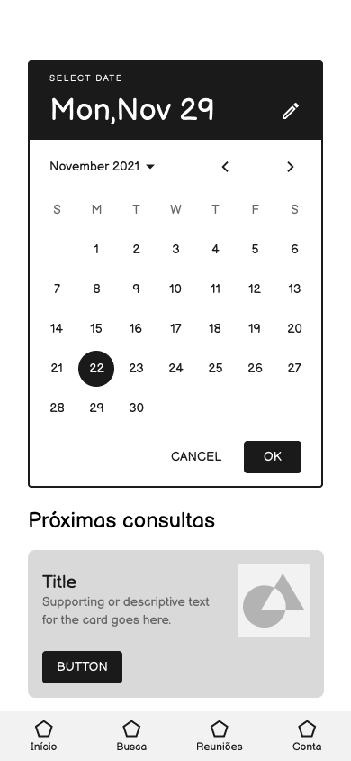

### RF-015 - Tela de Ganhos do Especialista
Na tela de ganhos do especialista haverá o saldo atual, gráficos com o demonstrativo dos ganhos mensais e o histórico de transações. 

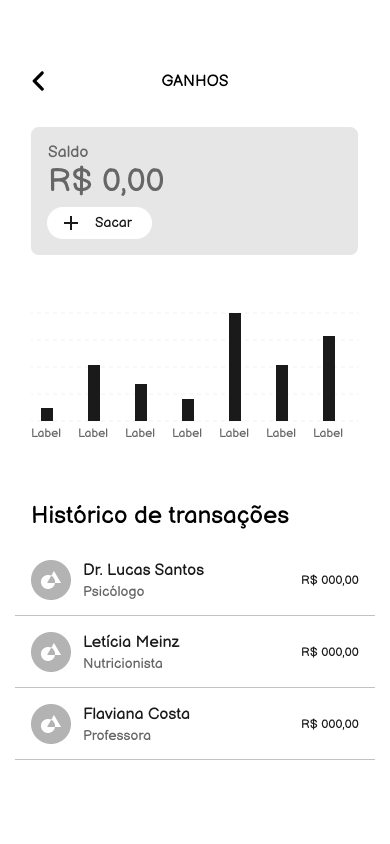

### RF-016 - Tela de Gestão de Horários
Na tela de gestão de horários contém os campos para definição das durações das chamadas.

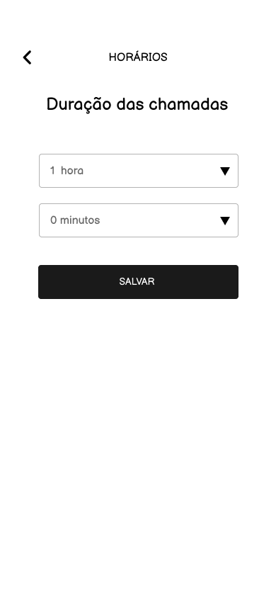

### RF-017 - Tela de Personalização do Perfil do Especialista
Na tela de personalização o especialista terá acesso as informações do cadastro e poderá alterá-las assim como a especialidade e a descrição do profissional.

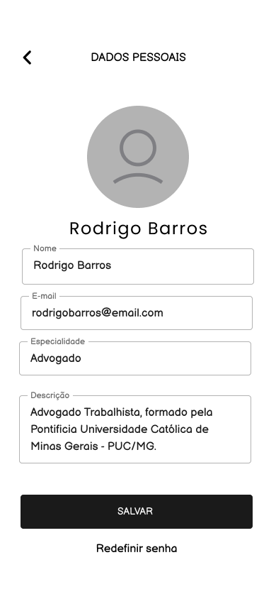

### RF-018 - Tela de Gestão de Contas
Na tela de gestão de contas haverá campos para cadastrar as contas utilizadas para receber o repasse e cards com as contas cadastradas com a opção de edição.

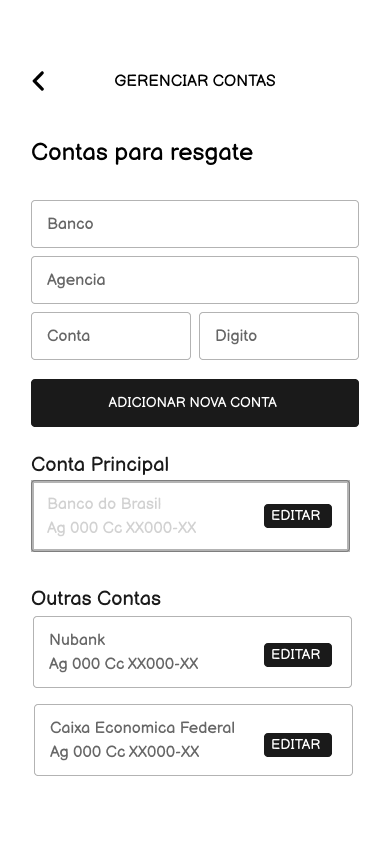

### RF-019 - Tela de Videochamada
Na tela de vídeochamada haverá um menu superior com os botões de compartilhamento de tela e encerramento da chamada e no menu inferior as configurações da chamada. No centro haverá a imagem do vídeo. 

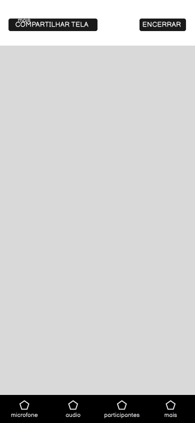

### RF-020 - Tela de Avaliação
Na tela de avaliação há 5 estrelas para avaliação do especialista ou do cliente e um campo de texto caso o usuário desejar deixar um comentário. 

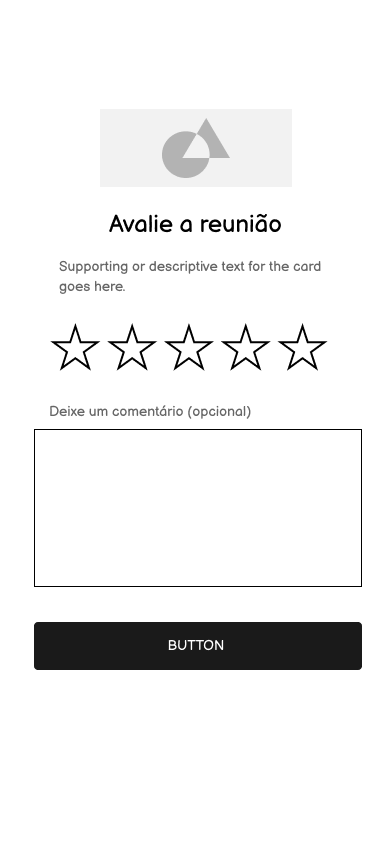

### RF-021 - Tela de Espera
Na tela de espera haverá uma ilustração e o texto explicativo sobre a chamada.

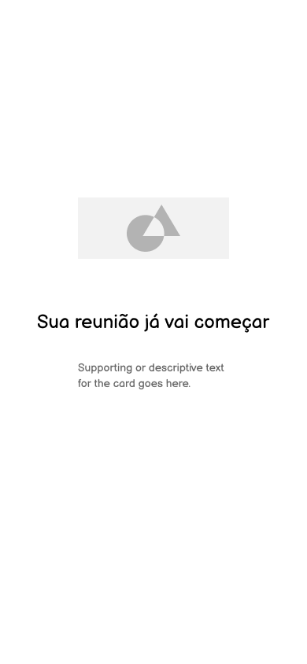

### RF-022 - Tela de Aceite
Na tela de aceite haverá uma ilustração, o texto com as  informações da reunião,
as opções de configuração de áudio e vídeo e o botão para entrar na videochamada.

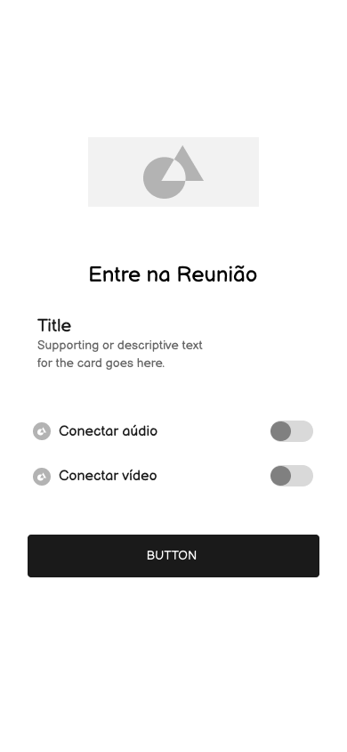

### RF-023 - Tela de Reconexão
Na tela de reconexão haverá uma ilustração e o texto de aviso sobre a reconexão. No caso de falha haverá outra tela com o aviso de que o usuário está offline.

### RF-024 - Tela de Ajuda
Na tela de ajuda haverá campos com temas de perguntas frequentes para auxiliar o usuário. Contém também o botão de retorno e o menu de navegação. 

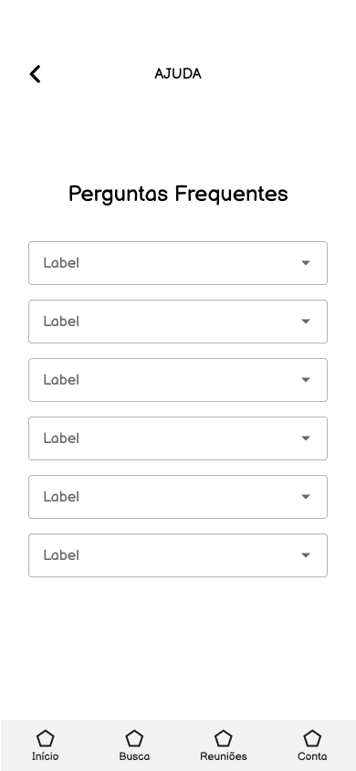

### RF-025 - Tela de Carregamento (spinner)
Na tela de carregamento haverá um ilustração animada, indicando o carregamento.

### RF-026 - Tela de Inicialização (splash screen)
Na tela de inicialização haverá o logo do aplicativo e mensagens informativas sobre o mesmo.

