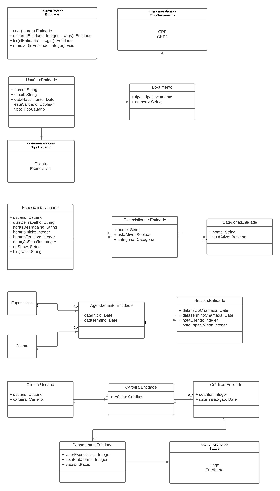
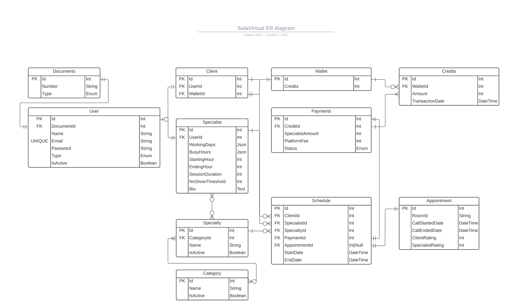
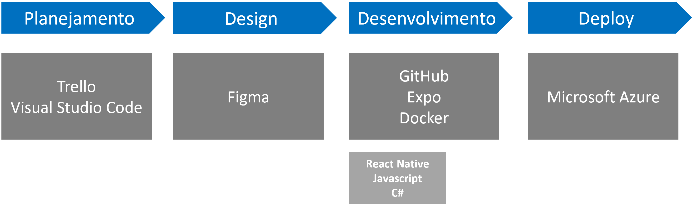

# Arquitetura da Solução

Pré-requisitos: <a href="3-Projeto de Interface.md"> Projeto de Interface</a>

Definição de como o software é estruturado em termos dos componentes que fazem parte da solução e do ambiente de hospedagem da aplicação.

## Diagrama de Classes

A estrutura da aplicação, as classes, os atributos e as relações entre as entidades, em termos de associações e multiplicidades, para produzir as funcionalidades do sistema podem ser vistos no diagrama abaixo: 

## Modelo ER

O Modelo ER representa através de um diagrama como as entidades (coisas, objetos) se relacionam entre si na aplicação interativa.]

As referências abaixo irão auxiliá-lo na geração do artefato “Modelo ER”.

> - [Como fazer um diagrama entidade relacionamento | Lucidchart](https://www.lucidchart.com/pages/pt/como-fazer-um-diagrama-entidade-relacionamento)

## Esquema Relacional

## Modelo Físico

Entregar um arquivo banco.sql contendo os scripts de criação das tabelas do banco de dados. Este arquivo deverá ser incluído dentro da pasta src\bd.

## Tecnologias Utilizadas

Para esse projeto foi escolhido um conjunto de tecnologias para todas as etapas do ciclo de desenvolvimento da aplicação.
Pode-se ver na figura a seguir o relacionamento entre as etapas e as tecnologias.

Para o planejamento fez-se uso do Visual Studio Code como editor de texto a fim de elaborar a documentação do projeto. É ainda nessa etapa que se inicia a utilização do Trello, ferramenta que permite que a equipe visualize as tarefas, gerencie prazos, atividades concluídas.

Com o planejamento adequado e já tendo examinado os requisitos, parte-se para a etapa de concepção do design, pois já é possível considerar as configurações necessárias para atender às necessidades da aplicação. Para isso, a ferramenta Figma foi empregue. Trata-se de um editor online para criação de protótipos e design de experiência do usuário. Neste momento são criados os templates da aplicação de forma colaborativa, uma vez que a ferramenta permite o trabalho em conjunto.

Na fase de Desenvolvimento a equipe constrói o código e realiza revisão para garantir confiabilidade em todos os aspectos da solução. O código foi desenvolvido utilizando ferramenta Expo, que já traz consigo muitos recursos de forma nativa e integrada do React Native que tem como linguagem o JavaScript. O back-end da aplicação foi criado com a linguagem C#. Para armazenar e controlar versões a equipe aderiu o uso do sistema GitHub.

A utilização da ferramenta Docker se faz necessária para obter um ambiente em que os sistemas e versões diferentes conversem entre si.

Por fim, para o deploy, a equipe determinou o uso da ferramenta Microsoft Azure para publicar o aplicativo e dados.

## Hospedagem

A equipe, a princípio optou pela plataforma Microsoft Azure para a hospedagem do aplicativo.

## Qualidade de Software

Conceituar qualidade de fato é uma tarefa complexa, mas ela pode ser vista como um método gerencial que através de procedimentos disseminados por toda a organização, busca garantir um produto final que satisfaça às expectativas dos stakeholders.

No contexto de desenvolvimento de software, qualidade pode ser entendida como um conjunto de características a serem satisfeitas, de modo que o produto de software atenda às necessidades de seus usuários. Entretanto, tal nível de satisfação nem sempre é alcançado de forma espontânea, devendo ser continuamente construído. Assim, a qualidade do produto depende fortemente do seu respectivo processo de desenvolvimento.

A norma internacional ISO/IEC 25010, que é uma atualização da ISO/IEC 9126, define oito características e 30 subcaracterísticas de qualidade para produtos de software.
Com base nessas características e nas respectivas sub-características, identifique as sub-características que sua equipe utilizará como base para nortear o desenvolvimento do projeto de software considerando-se alguns aspectos simples de qualidade. Justifique as subcaracterísticas escolhidas pelo time e elenque as métricas que permitirão a equipe avaliar os objetos de interesse.

> **Links Úteis**:
>
> - [ISO/IEC 25010:2011 - Systems and software engineering — Systems and software Quality Requirements and Evaluation (SQuaRE) — System and software quality models](https://www.iso.org/standard/35733.html/)
> - [Análise sobre a ISO 9126 – NBR 13596](https://www.tiespecialistas.com.br/analise-sobre-iso-9126-nbr-13596/)
> - [Qualidade de Software - Engenharia de Software 29](https://www.devmedia.com.br/qualidade-de-software-engenharia-de-software-29/18209/)
