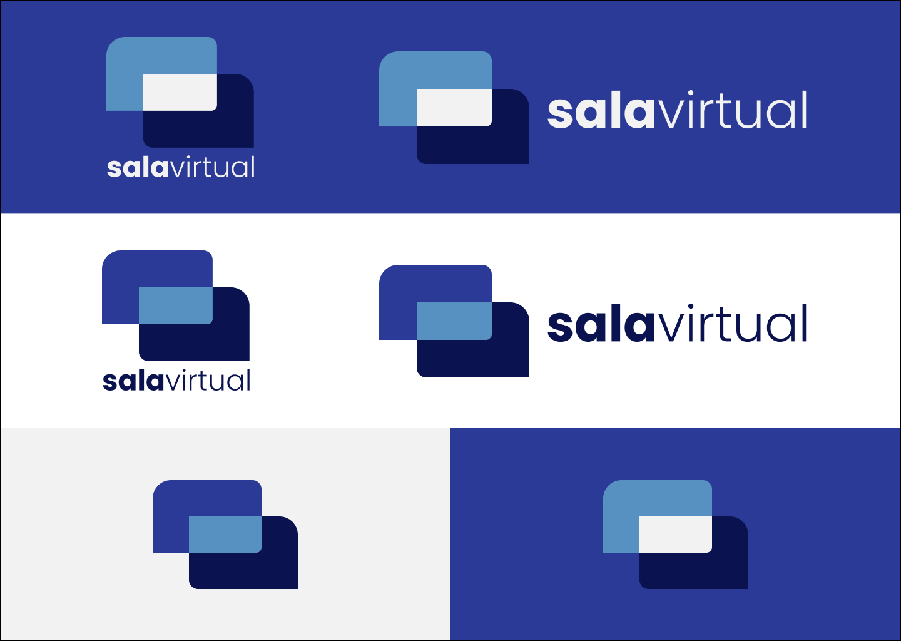
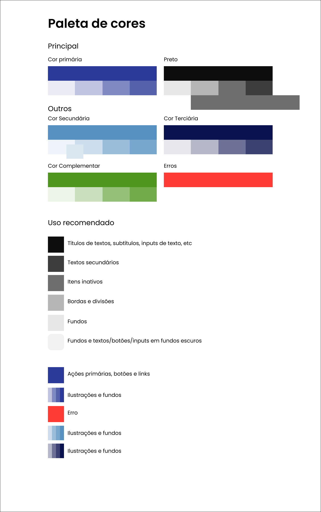
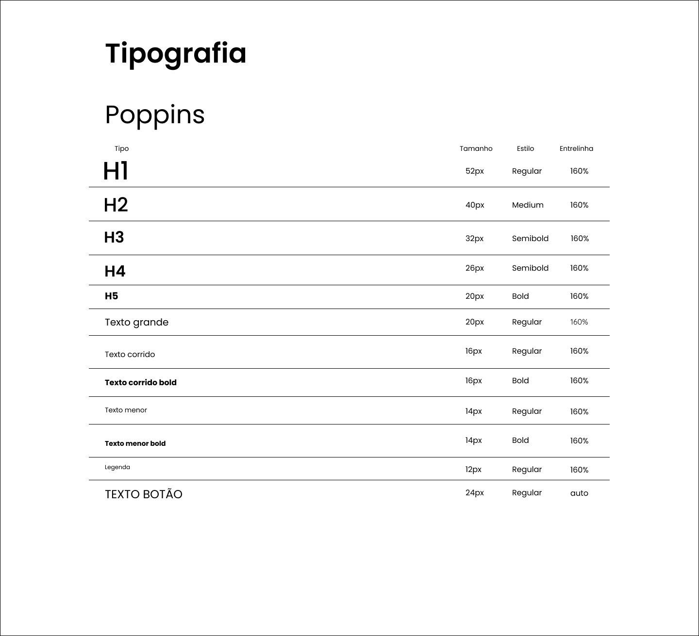
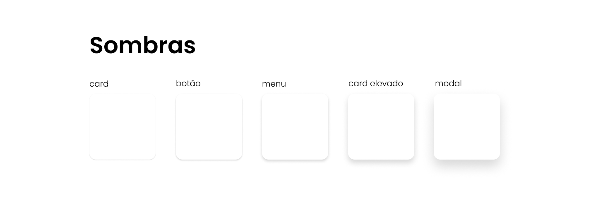
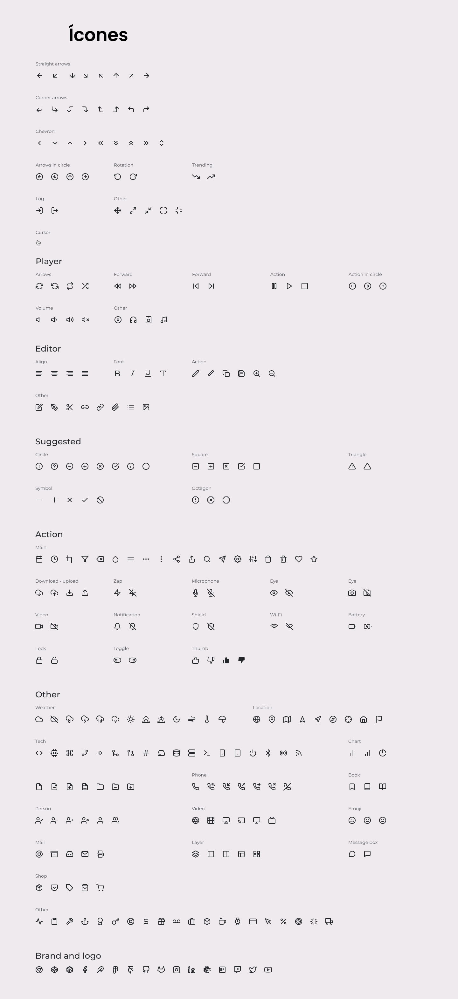
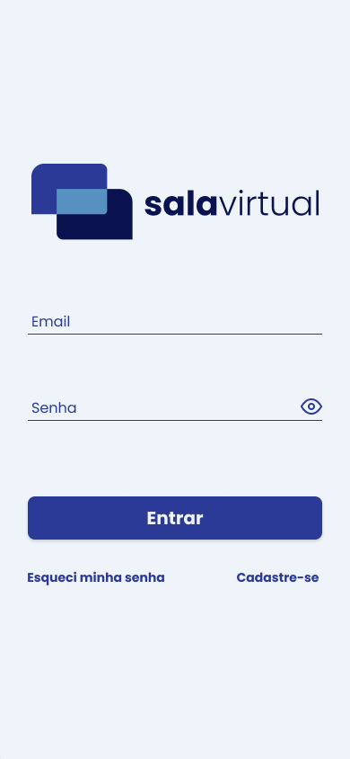
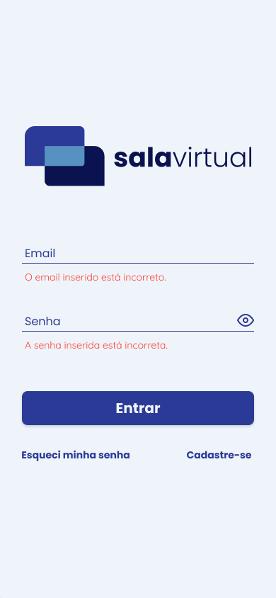

# Template Padrão da Aplicação

Foi desenvolvida uma identidade visual para o aplicativo Sala Virtual bem como o design system para o desenvolvimento da solução. Abaixo seguem as imagens com as aplicações de logo, cor, tipografia, sombreamento e iconografia. 

### Logo

### Cores

### Tipografia

### Sombreamento

### Ícones

### Exemplos de Aplicação

