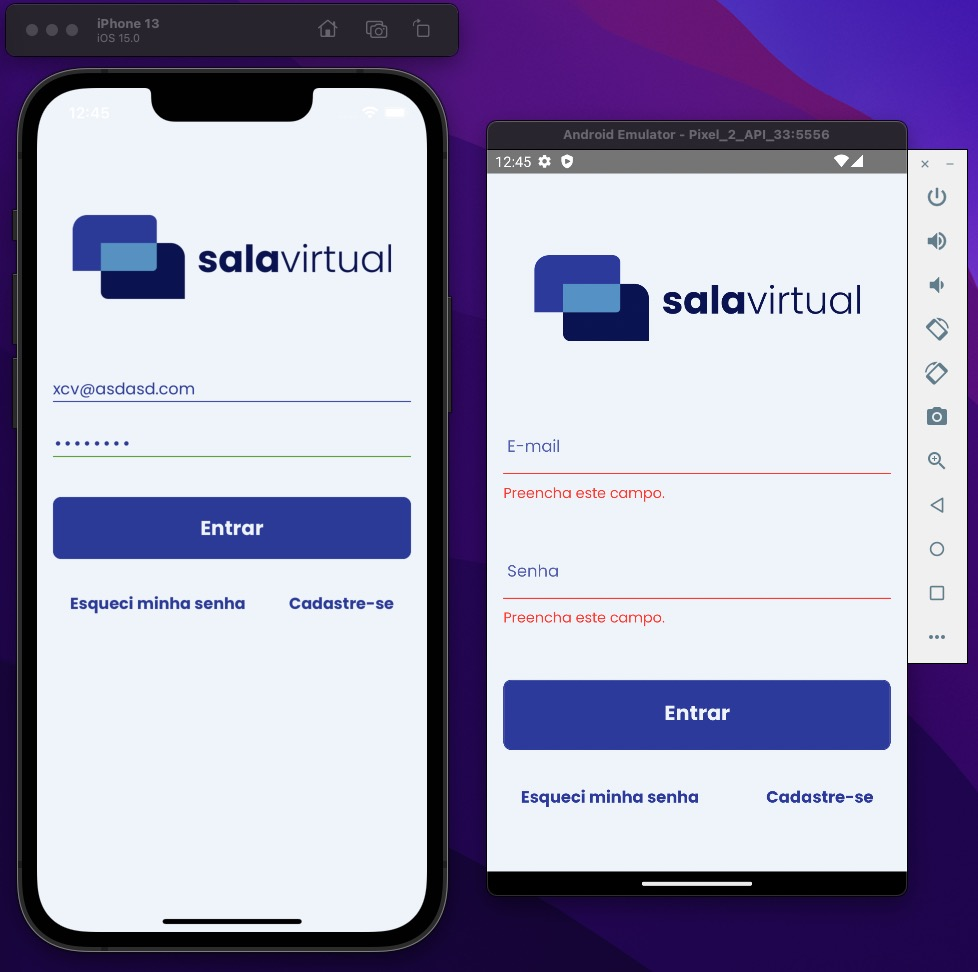

# Programação de Funcionalidades

## - Tela de Login

A primeira funcionalidade desenvolvida foi a correspodente ao requisito funcional 001 (O aplicativo deve oferecer um login aos usuários.). A tela de login oferece ao usuário um formulário para preenchimento do login, um botão para redefinição de senha e um botão de redirecionamento para a tela de cadastro. Também foram implementados a validação desse formulário e o requisito não funcional RN010. 
A tela já está disponível no repositório do projeto e apta para testes. 
A demonstração da tela em funcionamento está acessível no link: https://youtube.com/shorts/S_rdHWfravU

## Tela Esqueci Minha Senha - Paloma Chaves Silva

Atendendo ao requisito funcional 004 (O aplicativo deve fornecer uma opção de redefinição de senha), foi desenvolvida a tela "Esqueci minha senha". A tela é acessada por meio do botão "Esqueci minha senha". A tela possui a logomarca do aplicativo seguida de um texto com instruções para a redefinição da senha. Deve-se incluir o email cadastrado na plataforma. Se ele passar pela validação, quando o usuário pressionar o botão "Enviar", ele será direcionado para a tela que dá seguimento ao processo de redefinição da senha.

O registro do processo pode ser visto no vídeo presente no link a seguir: https://youtu.be/vtNJtTCkTsY

## - Tela de cadastro do especialista - Davison Cavalcante Barros

A tela de cadastro de especialista corresponde ao requisito funcional 003 (O aplicativo deve fornecer um formulário de cadastro para especialistas.). Nessa tela o especialista irá fornecer seus dados para ser cadastrado na plataforma, diferenciando o número do CNPJ, o qual o especialista deve possuir. 

## - Tela de Busca por especialidades - Davison Cavalcante Barros

A tela de busca por especialidades corresponde ao requisito funcional 010 (O aplicativo deve fornecer uma tela de listagem de especialidades para filtrar especialistas.). Nessa tela as especialidades são filtradas a partir da categoria selecionada, permitindo o usuário selecionar a especialidade que deseja buscar e ver os especialistas cadastrados para aquela especialidade cadastrados na plataforma.

A demonstração das telas de `Tela de cadastro do especialista` e `Tela de Busca por especialidades` está acessivel no link: https://youtu.be/Zhbo5hDS9Js

## - Tela Inicial do Cliente - Sabrina Chaves Silva

A tela inicial do cliente atende ao requisito funcional RF-008 (O aplicativo deve fornecer uma tela inicial para clientes, contendo suas próximas consultas), cuja prioridade é alta, contendo um card referente a próxima consulta, com os dados do especialista, a especialidade, o horário/data e a duração da reunião. O cliente pode realizar o cancelamento ou entrar na próxima reunião por esta tela. Abaixo do card encontra-se um banner que redireciona o cliente para a tela de busca por especialidades. 

O vídeo-apresentação referente a tela em questão pode ser visto no link: https://www.youtube.com/watch?v=kPXU6ETEZCs

## - Tela de Redefinição de Senha - Arthur Alves Rocha de Souza

A tela de redefinição de senha correspodente ao requisito funcional 004 (O aplicativo deve fornecer uma opção de redefinição de senha.). A tela oferece ao usuário um formulário para preenchimento da nova senha, confirmação da nova senha e um botão para entrar no aplicativo. Também foram implementados a validação desse formulário. 
A demonstração da tela em funcionamento está acessível no link: https://youtu.be/1VDbI7QkCVQ

## - Tela de Ajuste de Conta - Pedro Thiago Rodrigues Santos

A tela de Ajustes de Conta desempenha a função de aninhar as telas de gerencionamento da conta do usuário. Ela funciona como meio de navegação entre as respectivas telas. A tela de ajuste também conta com a função de sair do aplicativo atendendo ao  requisito funcional RF-007 (O aplicativo deve permitir fazer logout).

O video da explicação e demonstração do funcionamento da tela pode ser acessado através do link: https://www.youtube.com/watch?v=p8wWDVSXKbY

## - Tela de Edição de Perfil - Brunna Alves Lage Silva
A tela de edição de perfil do cliente que corresponde ao requisito funcional 005. Nela é permitido ao usuário a alteração do nome e da imagem de perfil e redireciona para a redefinição de senha. Para o desenvolvimento da tela foram utilizados os componentes "input", "button" e a validação do formulário feita por meio da biblioteca Formik. Foram necessários algumas alterações no componente input para cumprir os requisitos da tela.  A explicação completa está disponível em: https://youtu.be/z671szB5dCE