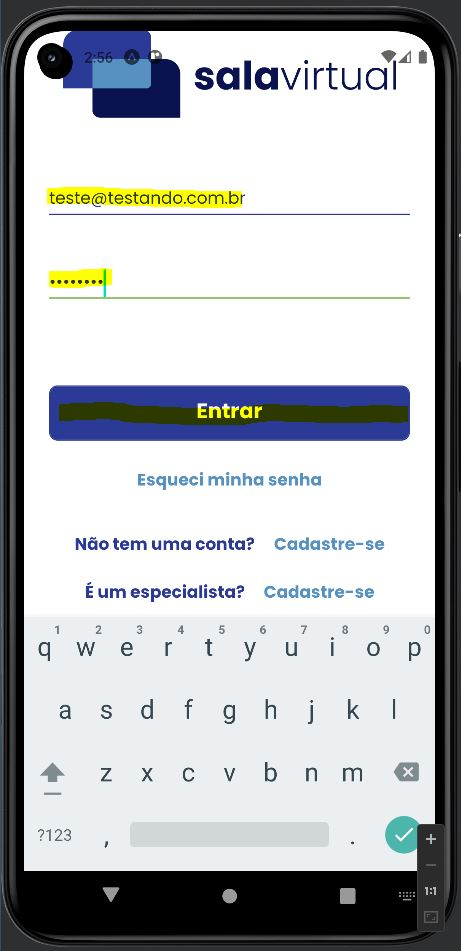

# Registro de Testes de Software

Pré-requisitos: <a href="3-Projeto de Interface.md"> Projeto de Interface</a>, <a href="8-Plano de Testes de Software.md"> Plano de Testes de Software</a>

##Teste de Cadastro de novos usuários (CT - 01)

O usuário acessa o menu de cadastro nos botões "cadastre-se" na tela de login da plataforma, conforme a imagem.

Ao acessar um dos botões o usuário é redirecionado para uma tela de cadastro especifica da natureza do cadastrante: Cliente ou Especialista, onde deve fornecer os dados mínimos exigidos pela plataforma, pode observar que as validações fornceidas para o cadastro estão funcionando de acordo com o projetado, podendo ser observado nas imagens abaixo:

Ao finalizar o cadastro o usuário é direcionado para a página inicial do aplicativo, permitindo o acesso deste a plataforma. Todos os passos do teste foram realizados com êxito, recebendo, assim, um status de AP, conforme o <a href="8-Plano de Testes de Software.md"> Plano de Testes de Software</a>.

##Teste de Login e logout (CT - 02)

O login foi realizado com um usuário cadastrado na plataforma, conforme a imagem abaixo:

Ao realizar o login o usuário é redirecionado para a tela de conta, onde pode ter acesso aos seus dados pessoais cadastrado, podendo, assim edita-los, caso seja necessário e também realizar o logout da conta.

Foi verificado êxito nos passos de login e logout dos usuários cadastrados na plataforma, dessa forma recebendo AP como status de teste.
